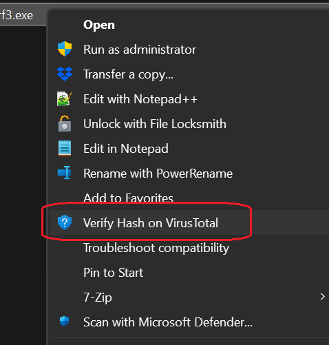

# 🚀 Verify file on Virus Total using right click

Quickly verify any file on Virus Total by just Right clicking, and selecting "Verify Hash on VirusTotal"

Applying the `VirusTotal_RightClick.reg` File adds extra command in File Explorer right click context menu for any file, which runs the below command
```
cmd /c for /f %%H in ('certutil -hashfile \"%1\" SHA256 ^| findstr /R /V \"hash\"') do \"C:\\Program Files (x86)\\Microsoft\\Edge\\Application\\msedge.exe\" https://www.virustotal.com/gui/file/%%H
```

The command does two actions:
1. Calculates SHA256 hash using certutil, and
2. Opens Virus total with url, constructed as
   `https://www.virustotal.com/gui/file/<hash value>`


